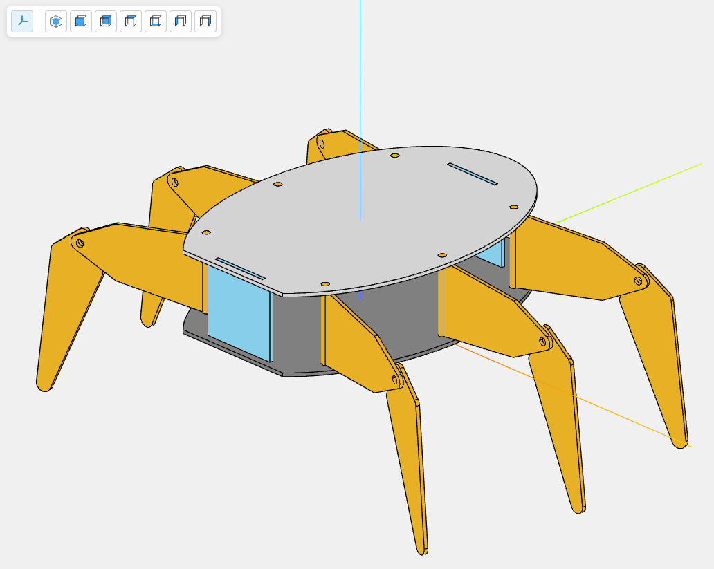

# lambda360view

**[Live Demo](https://lzpel.github.io/lambda360view/)**

A React component library for displaying 3D CAD-like models with edge rendering, built with [react-three-fiber](https://github.com/pmndrs/react-three-fiber).



## Features

- 📦 Load hierarchical 3D model data (vertices, normals, triangles, edges)
- 🎨 Per-part color and transparency support
- ✏️ Edge line rendering for CAD-style visualization
- 🖱️ Built-in orbit controls (rotate, zoom, pan)
- 📐 Automatic camera positioning based on bounding box
- ⚛️ Pure React + TypeScript implementation

## Installation

```bash
npm install lambda360view
```

### Peer Dependencies

Make sure you have these peer dependencies installed:

```bash
npm install react react-dom three @react-three/fiber @react-three/drei
```

## Usage

```tsx
import { Lambda360View } from 'lambda360view';
import type { ModelData } from 'lambda360view';

// Your model data
const model: ModelData = {
  version: 3,
  name: "myModel",
  id: "/myModel",
  parts: [
    {
      id: "/myModel/part1",
      name: "part1",
      type: "shapes",
      shape: {
        vertices: new Float32Array([...]),
        normals: new Float32Array([...]),
        triangles: new Uint32Array([...]),
        edges: new Float32Array([...]),
      },
      color: "#ff6600",
      loc: [[0, 0, 0], [0, 0, 0, 1]], // [position, quaternion]
    }
  ],
  bb: { xmin: -10, xmax: 10, ymin: -10, ymax: 10, zmin: -10, zmax: 10 },
};

function App() {
  return (
    <Lambda360View
      model={model}
      backgroundColor="#f0f0f0"
      edgeColor="#000000"
      showEdges={true}
      width="100vw"
      height="100vh"
    />
  );
}
```

## Props

| Prop | Type | Default | Description |
|------|------|---------|-------------|
| `model` | `ModelData` | required | The 3D model data to display |
| `backgroundColor` | `string` | `"#1a1a2e"` | Canvas background color |
| `edgeColor` | `string` | `"#000000"` | Color for edge lines |
| `showEdges` | `boolean` | `true` | Whether to render edges |
| `width` | `string \| number` | `"100%"` | Container width |
| `height` | `string \| number` | `"100%"` | Container height |
| `className` | `string` | - | Additional CSS class |
| `style` | `CSSProperties` | - | Additional inline styles |

## Model Data Format

The library accepts a hierarchical model format with the following structure:

```typescript
interface ModelData {
  version: number;
  name: string;
  id: string;
  parts: Part[];
  bb: BoundingBox;
}

interface Part {
  id: string;
  name: string;
  type: string;
  shape?: ShapeData;
  color?: string;
  alpha?: number;
  loc?: [[number, number, number], [number, number, number, number]];
  parts?: Part[]; // Nested child parts
}

interface ShapeData {
  vertices: Float32Array;  // [x1, y1, z1, x2, y2, z2, ...]
  normals: Float32Array;   // [nx1, ny1, nz1, ...]
  triangles: Uint32Array;  // Triangle indices
  edges: Float32Array;     // Line segment pairs for edges
}
```

## Example

See the [examples](./examples) directory for a complete Next.js example displaying a hexapod robot model.

```bash
# Run the example
npm install
npm run build
cd examples && npm run dev
```

## License

MIT

## Author

[lzpel](https://github.com/lzpel)
