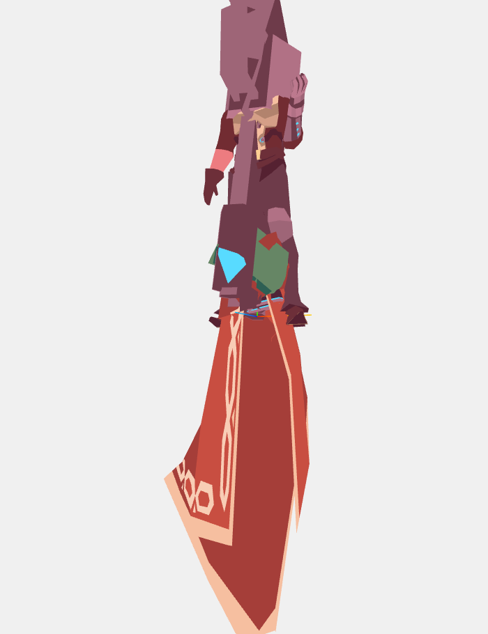

# GLB対応 改造計画報告書 (2026-02-15)

20260214-改造計画に基づきGLB読み込み機能を実装した際に発生した問題と対策を記録する。

## 実装概要

改造計画のPhase 1〜3を実装し、GLBファイルをURL指定(`glbUrl`)またはバイナリ直接渡し(`glbData`)で読み込み、既存のJSON渡しと同じレンダリングパイプラインで表示できるようにした。

### 追加・変更ファイル

| ファイル | 内容 |
|---|---|
| `src/loaders/glbLoader.ts` | 新設。GLTFLoaderでパースし、ModelData形式に変換 |
| `src/types.ts` | `Part`に`geometry`、`edgeGeometry`、`extras`フィールドを追加 |
| `src/components/PartMesh.tsx` | `shape`(JSON系)と`geometry`(GLB系)の二系統入力に対応 |
| `src/components/Lambda360View.tsx` | `glbUrl`/`glbData` propsを追加、非同期ロード対応 |
| `examples/app/glb/page.tsx` | GLBビューアのデモページ |

---

## 発生した問題

### 問題1: React Hooksの呼び出し順序違反

**症状**: コンソールに以下のエラーが表示され、GLBモデルが描画されない。

```
React has detected a change in the order of Hooks called by Lambda360View.

   Previous render            Next render
   ------------------------------------------------------
5. useEffect                  useEffect
6. undefined                  useMemo
```

**原因**: `Lambda360View`内でGLBの非同期ロード完了を待つ間、`model`がnullの状態で早期リターンしていた。この早期リターンが`useMemo`フック呼び出しより前にあったため、ロード前後でフックの呼び出し順序が変わり、Reactの[Rules of Hooks](https://react.dev/link/rules-of-hooks)に違反していた。

```tsx
// NG: 早期リターンの後にフックがある
const model = modelProp ?? glbModel;
if (!model) return <div>Loading...</div>;       // ← ここで抜ける
const cameraConfig = useMemo(() => { ... }, []); // ← ロード後に初めて到達
```

**対策**: `useMemo`等のフック呼び出しを全て早期リターンより前に移動した。`useMemo`内部でmodelがnullの場合はnullを返すようにし、早期リターン条件を`!model || !cameraConfig`に変更した。

```tsx
// OK: フックが常に同じ順序で呼ばれる
const model = modelProp ?? glbModel;
const cameraConfig = useMemo(() => {
    if (!model) return null;
    // ...計算
}, [model]);
const upAxisRotation = useMemo(() => getUpAxisRotation(upAxis), [upAxis]);

if (!model || !cameraConfig) return <div>Loading...</div>;
```

---

### 問題2: GLBモデルの表示崩れ（ノードのscale欠落）

**症状**: GLBモデル(low_poly_mccree.glb)が読み込まれるが、パーツの大きさ・配置が崩れて正しいモデル形状にならない。



**原因**: `glbLoader.ts`の`convertObject3D`関数で、各ノードのトランスフォームとして`position`と`quaternion`のみ抽出し、**`scale`を完全に無視**していた。

glTF/GLBのシーングラフでは、各ノードがTRS(Translation, Rotation, Scale)の3つのトランスフォームを持つ。特にBlender等のDCCツールから書き出されたモデルでは、ノード階層内でscaleが非一様(例: `[1, 1, -1]`で軸反転)に設定されていることが多い。このscaleが欠落した状態でposition/quaternionのみ適用されると、パーツの大きさが合わずモデル全体が崩れる。

```typescript
// NG: scaleが欠落
const loc: Location = [
    [obj.position.x, obj.position.y, obj.position.z],
    [obj.quaternion.x, obj.quaternion.y, obj.quaternion.z, obj.quaternion.w],
];
// obj.scale は捨てられていた
```

**対策**: 3ファイルを修正した。

1. **`src/types.ts`**: `Part`インターフェースに`scale?: [number, number, number]`を追加
2. **`src/loaders/glbLoader.ts`**: `obj.scale`を抽出し、デフォルト値`[1,1,1]`でない場合にPartへ格納
3. **`src/components/ModelRenderer.tsx`**: `<group>`要素に`scale`プロパティを適用

```typescript
// OK: scale も抽出して適用
const s = obj.scale;
const hasNonDefaultScale = s.x !== 1 || s.y !== 1 || s.z !== 1;
// Part に scale を含める
...(hasNonDefaultScale && { scale: [s.x, s.y, s.z] })
```

既存のJSON渡しパイプラインではscaleフィールドは存在しないためデフォルト`[1,1,1]`が使われ、後方互換性に影響はない。

---

## 教訓

1. **非同期ロードを伴うコンポーネントでは、全てのフック呼び出しを早期リターンより前に配置する必要がある。** JSON渡し(同期)のみの時代には問題にならなかったパターンが、GLB渡し(非同期)の導入で顕在化した。

2. **3Dシーングラフの変換では、TRS(Translation, Rotation, Scale)の3要素全てを保持する必要がある。** BufferGeometryだけでなく、ノード階層の全トランスフォームがモデル形状に影響する。特にscaleは見落としやすいが、DCCツールからのエクスポートでは頻繁に非デフォルト値が使われる。
